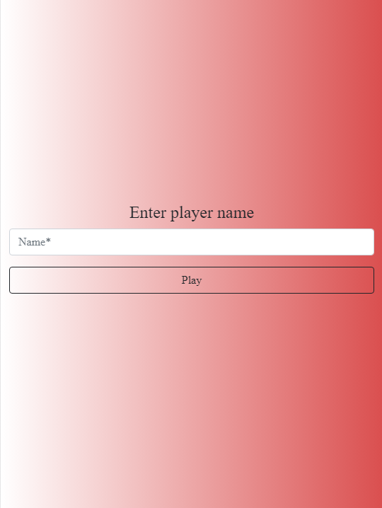
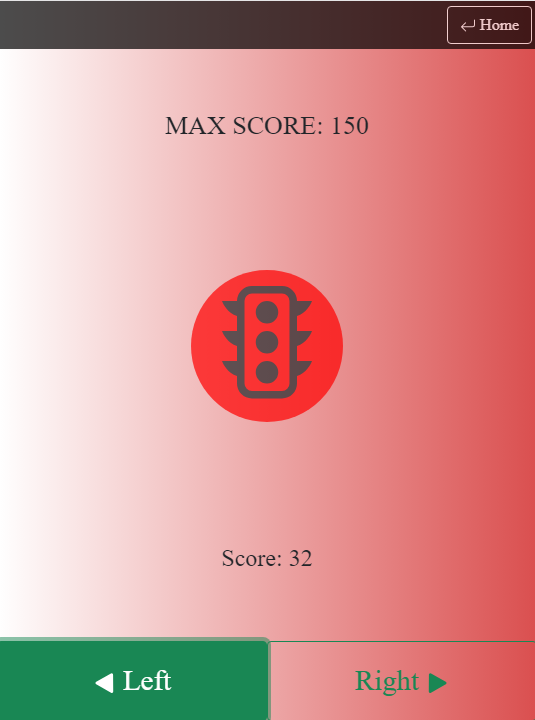

## Link URL Vercel Deployment
https://red-green-github-io.vercel.app/#/home

# Installation

  To run the application follow the next steps:

  - 1. Clone the repository in your desktop.

 

  - 2. Open a terminal in the root directory of the project.

 

  - 3. Write the command 'npm i' in the terminal to install all the dependencies from the project.

 

  - 4. After it's completed, run the command 'ng serve' to run the project on localhost.

 

  - 5. Open your browser and navigate to 'http://localhost:4200/'.

 

  - 6. You can also use the link bellow 'Installation' to open a deployment of the project on [Vercel](https://vercel.com).

 

  - 7. If you want to run it on your mobile device, you can open the link of the deployment on your mobile device and install the app through it".

 

  - 8. Have fun!".

 
 

# Instructions

  Once we open the app, we will be on the Home view and see something like this:

  It is important to notice that if we dont write any name on the field, we wont be able to play the game.
  Once we write the name player we want to use, we can press the 'Play' button, this will lead us to the Game view.

  <strong>*Before we navigate there, the app will check in his indexed DB if this player was created in this same device. 
  If so, it will load his previous game at the same point he left it. If not, we will just create a new game.*</strong>

  Now on the Game view we will be seeing this:

  First of all, we have up right the button 'Home' that will lead us back to the Home view. In addition, the moment we press it, it will automatically save our game status for this player name.
  This means that if we return to the home view and type again the same name player, we will have the score we had the moment we left our last game. It will also load the maximum score we reached with this name player.

  In the middle of the screen we will see the icon of a traffic light. The background color of this image will change between green and red. The red light will last 3s, but the green light will depend on our score.
  Every 'step' or point we make will decrease the timer 100ms to a minimum of 2 secons. In addition, it will be randomized with +/-1500 ms. In summary, the range seconds may vary from 11,5 seconds to 500 milliseconds!

  At last but not least, we will find two buttons down bottom. These buttons are supposed to be pressed when the traffic light color is green. We must press these buttons alternately to win points. Every time we press one button, will win us 1 point, but watch out! If we press one button twice in a row, will cost us 1 point. If we press any of these two buttons when the light is red, we will loose all of our points and will reset to 0.

  The goal of this game is simple... Get as much points as you can! Good luck!

 

# Usefull commands

Run `ng serve` for a dev server. Navigate to `http://localhost:4200/`. The application will automatically reload if you change any of the source files.

Run `ng build` to build the project. The build artifacts will be stored in the `dist/` directory.

Run `ng test` to execute the unit tests via [Karma](https://karma-runner.github.io).

 

# Dependencies
This project has the following dependencies:
<ul>
  <li>[Angular CLI](https://github.com/angular/angular-cli) version 16.2.4.</li>
  <li>[Bootstrap 5](https://github.com/twbs/bootstrap) version 5.3.2</li>
  <li>[Bootstrap Icons](https://github.com/twbs/icons) version 1.11.1</li>
  <li>[idb](https://github.com/jakearchibald/idb) version 7.1.1</li>
  <li>[Rxjs](https://github.com/ReactiveX/rxjs) version 7.8.0</li>
  <li>[Tslib](https://github.com/microsoft/tslib) version 2.3.0</li>
  <li>[Zone.js](https://github.com/angular/zone.js) version 0.13.0</li>
  <li>We will also require a minimum version of Node 16.13.0</li>
<ul>

